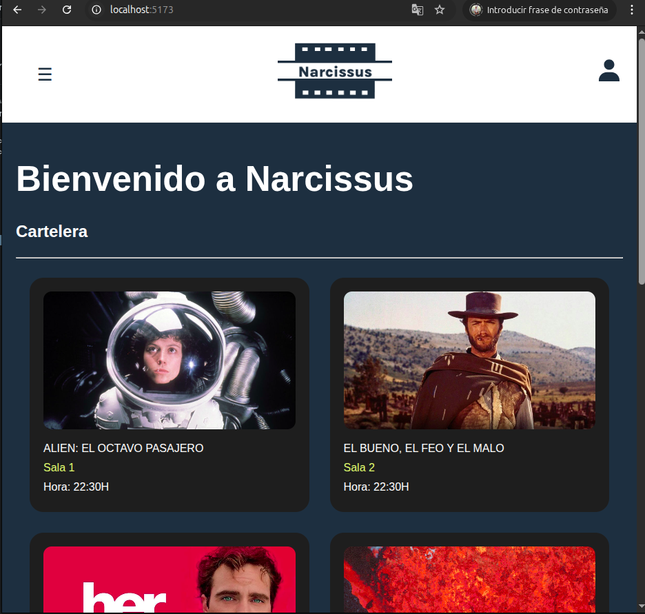
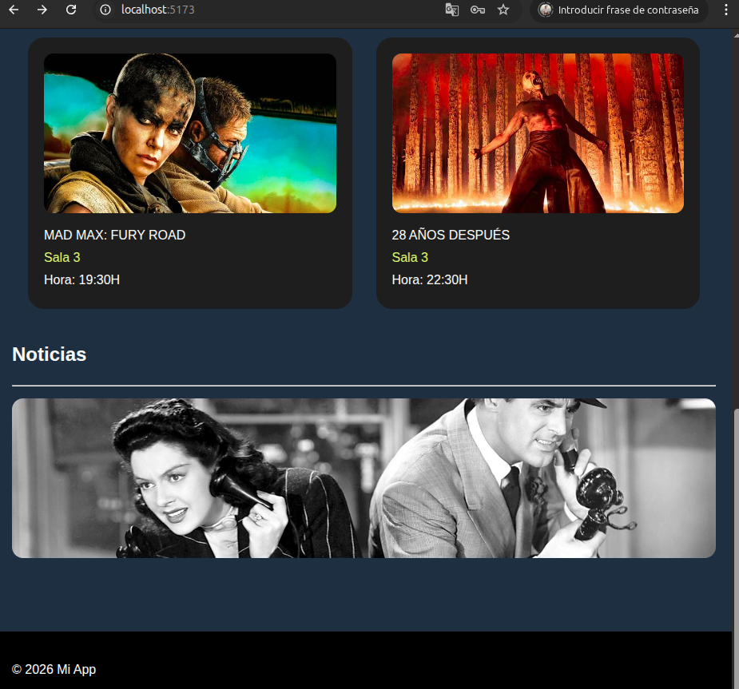
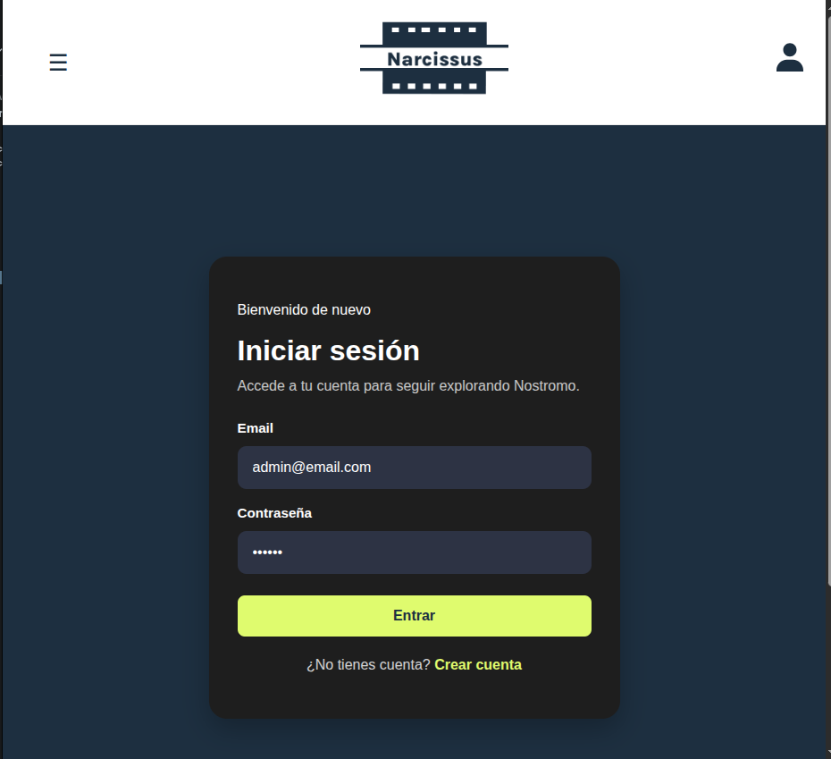
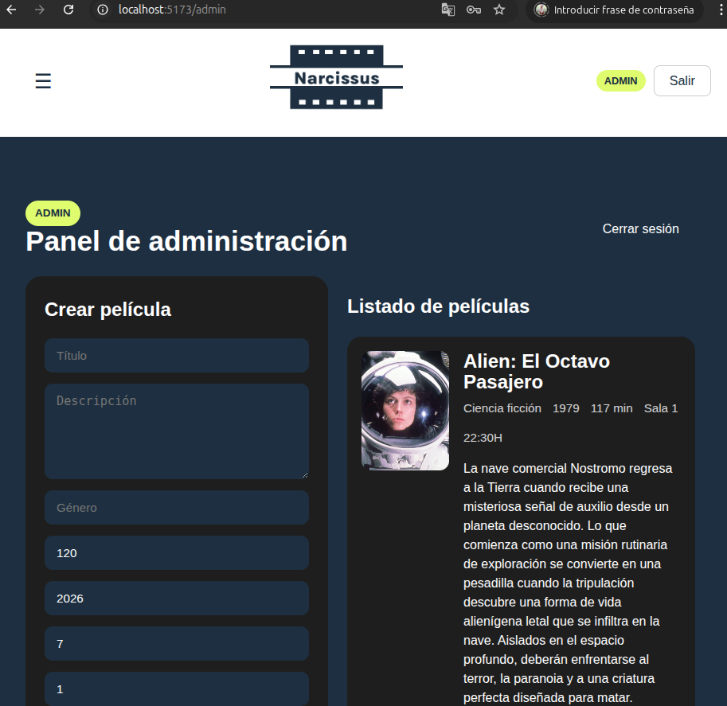
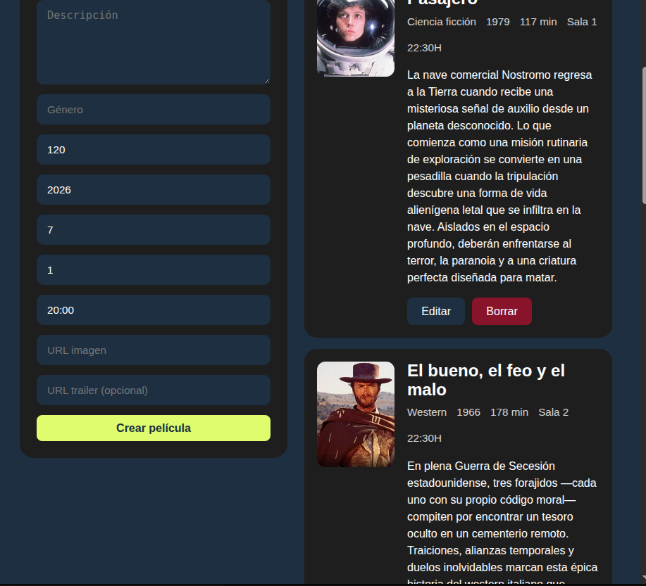
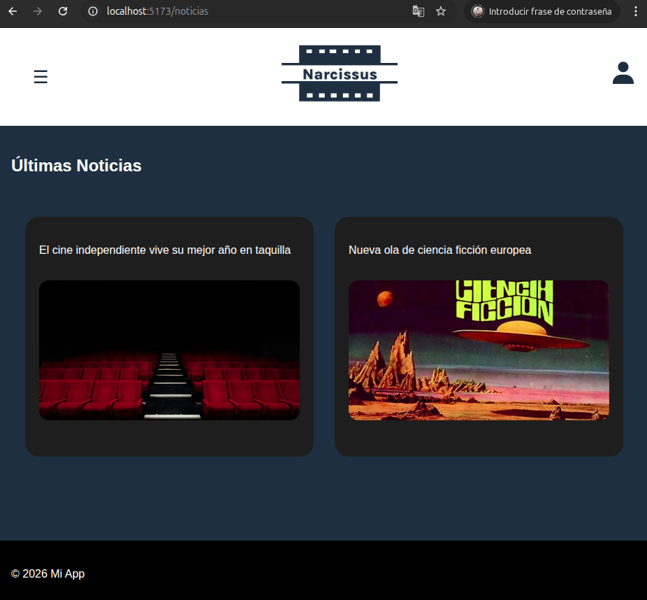
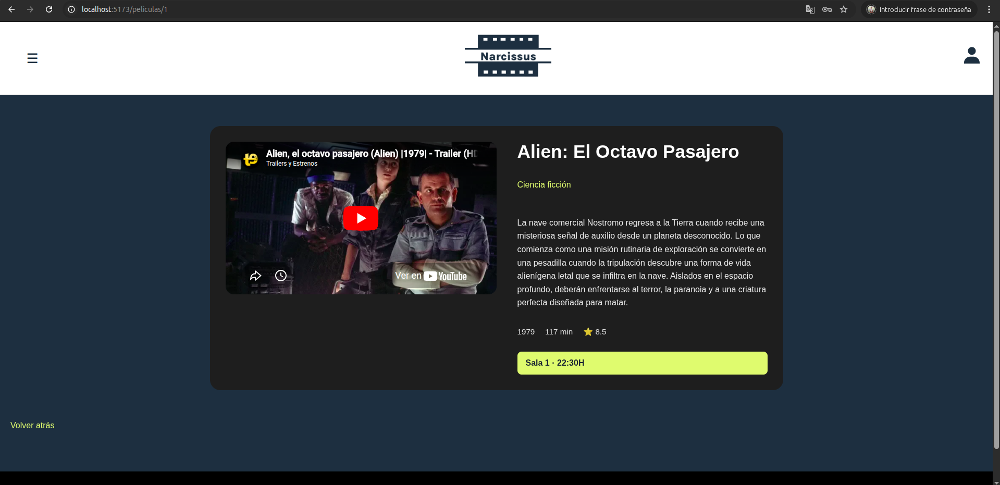
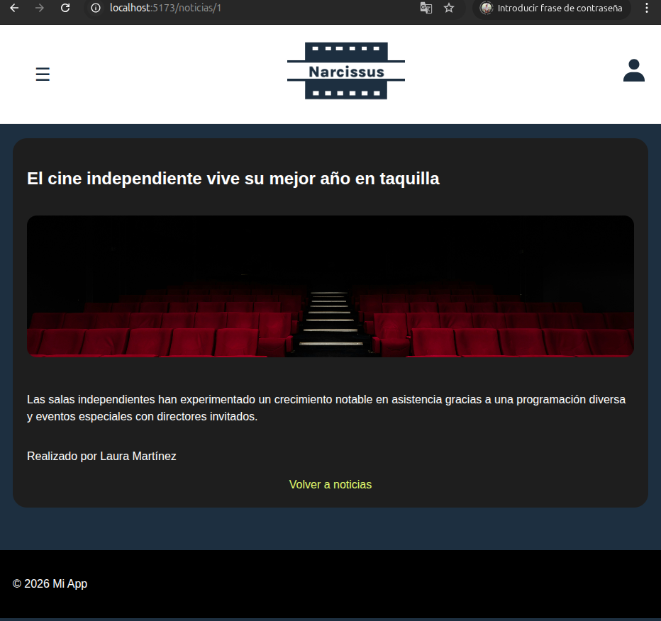

# Narcissus

Aplicación web fullstack para gestión de cine independiente

## Funcionalidades

- Registro y login de usuarios
- Autenticación con JWT
- Roles: USER y ADMIN
- Persistencia de sesión
- Panel de administración
- CRUD de películas
- Visualización de películas y noticias

## Tecnologías

Frontend:
- React
- TypeScript
- Vite

Backend:
- Node.js
- Express
- Prisma

Base de datos:
- PostgreSQL / SQLite

## Capturas

### Home





### Login


### Admin




### Cartelera



### Noticias





## Instalación

```bash
git clone https://github.com/vmenflo/Narcissus.git
cd Narcissus
```

- Frontend
```bash
cd /frontend
npm run dev
```

- Backend
```bash
cd /Api
npm run dev
```

